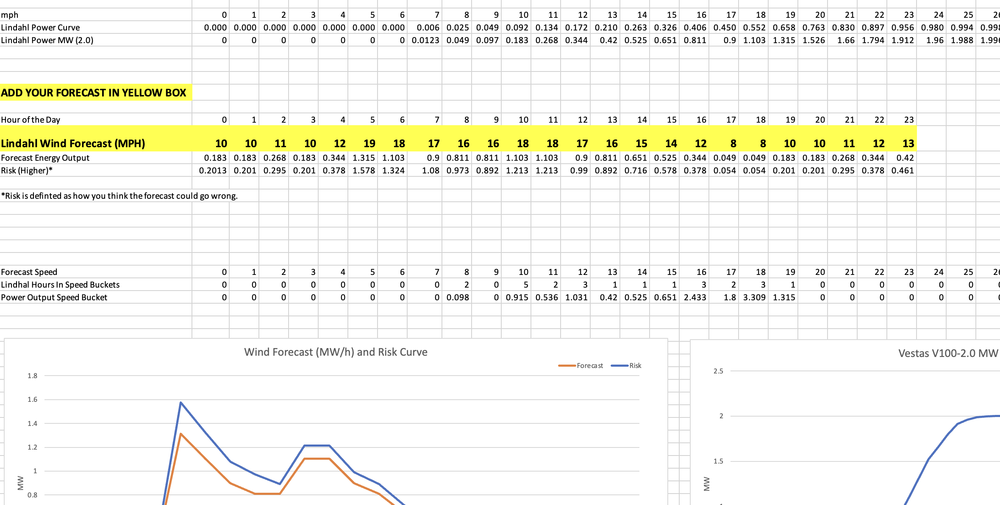

# Simple Conversion of Wind Forecast to Wind Power Output by Turbines

This excel file contains a template to convert wind forecasts on a wind turbine farm into potential wind power output. In order to use this template a few things should be understood:

1) Wind forecasts are for 80 meters above the ground,at wind turbine height.

2) You must gain access to the wind turbine power curve specifications. Each turbine has a different power curve to indicate how much power it creates at various wind speeds.

3) It is assumed the wind speed is an average over an hour.

4) Lastly, this template will producethe power output over 24 hours for a single turbine. Since farm contain multiple turbines over a large area, they may individually experience different wind speeds based on local effects.

Below in the screenshots section you'll see an image of the Excel file you can use to quickly translate your wind forecast to power output. Note that there is something called a risk curve which is also explained below. 

## Risk Curve

The risk curve in this example is used to describe how the forecast could go wrong. For example, maybe the wind forecast has the potential of being higher than forecast if certain variables were to change. This risk incoporated into the chart to give a sense of the chance that more or less power may be created.

## Screenshots of Excel Sheet and Charts

